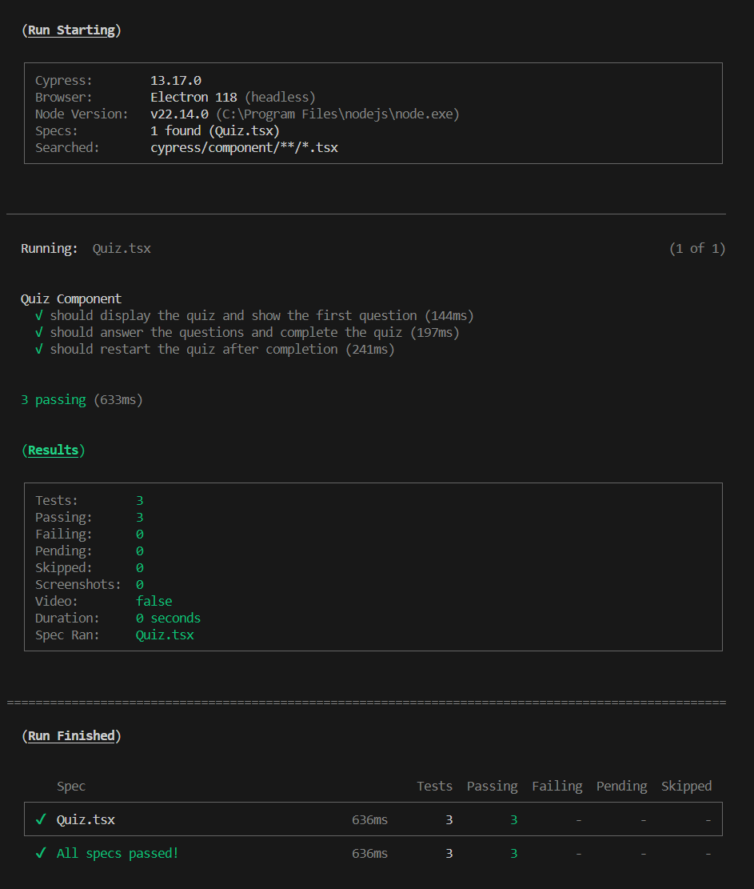
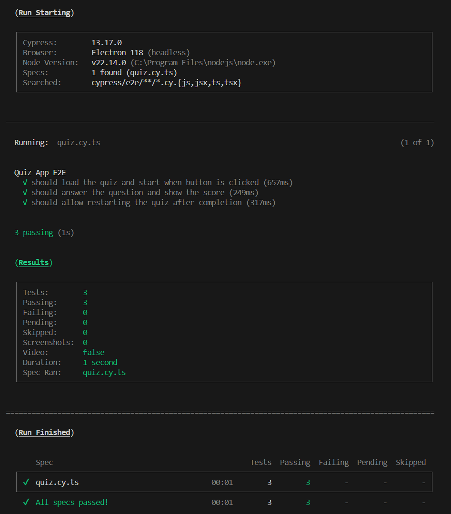

# Tech Quiz – Cypress Testing

_A MERN stack Tech Quiz application enhanced with Cypress component and end-to-end testing._


---

## Description

This project demonstrates how to add [Cypress](https://www.cypress.io/) for both component and end-to-end (E2E) testing to a full-stack MERN Tech Quiz app. The application allows users to take a quiz of random questions and view their score. Cypress is used to ensure the quiz component and user flows work as expected, providing confidence that the core quiz experience works for real users.

---

## Table of Contents

- [Tech Quiz – Cypress Testing](#tech-quiz--cypress-testing)
  - [Description](#description)
  - [Table of Contents](#table-of-contents)
  - [Features](#features)
  - [Technologies Used](#technologies-used)
  - [Media](#media)
  - [Getting Started](#getting-started)
    - [Prerequisites](#prerequisites)
    - [Installation](#installation)
  - [Cypress Testing](#cypress-testing)
    - [Run Cypress Tests](#run-cypress-tests)
    - [Test Structure](#test-structure)
  - [Usage](#usage)
  - [License](#license)
  - [Contributing, Support, and FAQ](#contributing-support-and-faq)
  - [Notes](#notes)
  - [Acknowledgments](#acknowledgments)
  - [Author](#author)

---

## Features

- Take a quiz with random questions
- View your score at the end of the quiz
- Restart the quiz to try again
- **Cypress component tests** for the Quiz component
- **Cypress E2E tests** for the full quiz flow

---

## Technologies Used

- **Frontend:**
  - [React](https://reactjs.org/)
  - [Vite](https://vitejs.dev/)
  - [TypeScript](https://www.typescriptlang.org/)
  - [Bootstrap](https://getbootstrap.com/)
- **Backend:**
  - [Node.js](https://nodejs.org/)
  - [Express.js](https://expressjs.com/)
  - [MongoDB](https://www.mongodb.com/)
- **Testing:**
  - [Cypress](https://www.cypress.io/) (component & E2E)

---

## Media

**Walkthrough Video:**
A video demonstration of all Cypress tests running and passing:
[Watch the Cypress Testing Demo](https://drive.google.com/file/d/19BKAONjr81Zsa4OhIS5E7it55misjYtz/view?usp=sharing)

**Screenshots:**
_Component Test Passing in Terminal:_


_E2E Test Passing in Terminal:_


---

## Getting Started

### Prerequisites

- [Node.js](https://nodejs.org/) v18+
- [npm](https://www.npmjs.com/)
- [MongoDB](https://www.mongodb.com/) (local or cloud)

### Installation

1. **Clone the repository:**

    ```bash
    git clone https://github.com/your-username/tech-quiz-cypress-testing.git
    cd tech-quiz-cypress-testing
    ```

2. **Install dependencies:**

    ```bash
       npm install
    ```

3. **Set up environment variables:**

    - Rename the `.env.example` file to `.env` in the `server` directory and update as needed.

4. **Start the app:**

    ```bash
    npm run start:dev
    ```

---

## Cypress Testing

### Run Cypress Tests

> **Note:** Make sure the app is running before running E2E tests.

- **Run all tests from the command line:**

    ```bash
    npm run test
    ```

- **Open Cypress UI:**

    ```bash
    npx cypress open
    ```

### Test Structure

- `cypress.config.ts` – Cypress configuration for both component and E2E testing
- `cypress/component/Quiz.tsx` – Cypress component tests for the Quiz component
- `cypress/e2e/quiz.cy.ts` – Cypress end-to-end tests for the quiz flow
- `cypress/fixtures/questions.json` – Mock data for testing

---

## Usage

1. **Start the App:**
   Run `npm run start:dev` and ensure both the client and server are running.

2. **Open the Application:**
   Visit [http://localhost:3001](http://localhost:3001) in your browser.

3. **Start the Quiz:**
   Click the **"Start Quiz"** button to begin.

4. **Answer Questions:**
   Select your answer for each question as they appear.

5. **View Your Score:**
   After the last question, your score will be displayed.

6. **Restart the Quiz:**
   Click **"Take New Quiz"** to start over and try again.

---

## License

This project is licensed under the [MIT License](./LICENSE.txt).

See the [MIT License text](https://opensource.org/licenses/MIT) for full details.

---

## Contributing, Support, and FAQ

- **Contributions:**
    Contributions to improve Cypress tests, add new test cases, or enhance documentation are welcome! Please open an issue or submit a pull request.

- **Support:**
    If you encounter issues with Cypress tests, configuration, or the test suite, please open an issue on GitHub with details and steps to reproduce.

- **FAQ:**
  - _How do I run the Cypress tests?_
        See the [Cypress Testing](#cypress-testing) section above for instructions on running tests from the command line or UI.
  - _Can I use these Cypress tests for my own MERN project?_
        Yes! The Cypress setup and test examples can be adapted for any React or MERN stack project.
  - _Cypress can't find my app or tests aren't running?_
    - Make sure your app is running (`npm run start:dev`) before running E2E tests.
    - Double-check your `baseUrl` in `cypress.config.ts`.
    - Ensure all dependencies are installed with `npm install`.
  - _How do I add more component or E2E tests?_
    - Add new files to `cypress/component/` for component tests or `cypress/e2e/` for E2E tests.
    - Use the existing tests as templates for structure and best practices.

---

## Notes

- The codebase is commented for educational purposes and future reference.

---

## Acknowledgments

Portions of this project were developed using starter code provided by [edX Boot Camps LLC](https://bootcamp.edx.org/) for educational purposes.

## Author

Created by Sharon Heim.

---

© 2025 Tech Quiz Project
